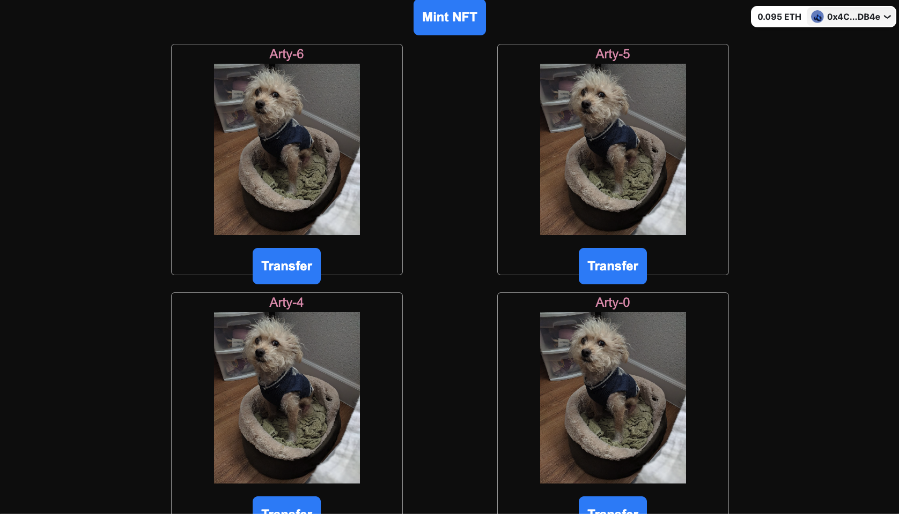

## The Arty NFT Gallery

A demo application that allows users to connect their wallets and fetches all instances of the user's ArtyNFTs on the Sepolia testnet. 

The app is hosted on Vercel. Visit it by pointing your browser to [https://nft-display-umber.vercel.app/]().



## Structure

This application is a Next.js app. It utilizes RainbowKit to implement wallet connection functionality and Wagmi to implement the NFT transaction logic.

ArtyNFTs are fetched from a bespoke webserver that is hosted at [https://render.com](). You can find the webserver code at [https://github.com/seanchen1991/nft-server]().

The high-level layout and component structure of the code is specified in the `app` directory. 
```
app
├── page.js
└── layout.js
```
The majority of the logic are implemented as React components, which are all located in the `components` directory.
```
components
├── Card.js
├── Header.js
├── LoggedIn.js
├── LoggedOut.js
└── FetchNfts.js
├── TransferNft.js
└── WalletProvider.js
```
